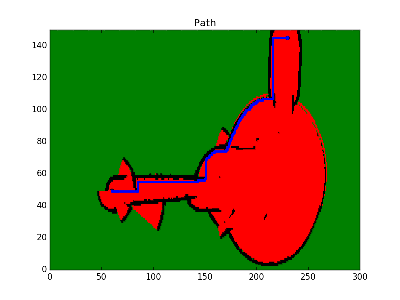

# Path Planning Exercise
This repo was created to apply some courses followed in Udacity. 

Here was implemented A* algorithm.

Those are the different paremeters used for this implementation :

- Map size : **[300x150]**
- Robot start position : **{230,145}**
- Robot Goal Position  : **{60,50}**
- Direction of Movement : Up **{-1,0}**, Left **{0,-1}** , Right **{0,1}** , Down **{1,0}**
- Cost Movement : **1**
- Heuristic Vector : **Manhattan**

To run that code, type these command :
```
$ cd path_planning/
$ rm -rf Images/*
$ g++ main.cpp -o app -std=c++11 -I/usr/include/python2.7 -lpython2.7
```

Then run the program 
```
$ ./app
```

An image is saved when program is done. Look in Images folder.

## Path generated 



Map used here was created from another courses (Occupancy mapping grid).

* Red -> Free zone
* Black -> Occupied zone
* Green -> Unknown/Undiscovered zone
* Blue -> Shortest Paths
